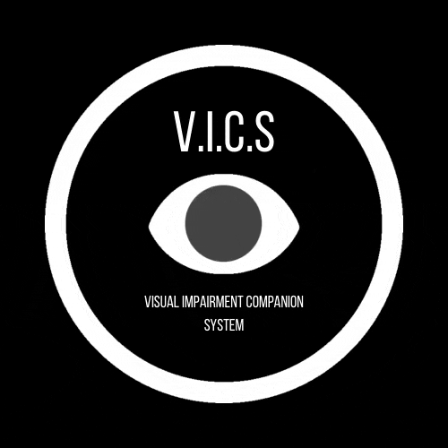

# V.I.C.S (Visual Impairment Companion System)

 
**Powered by Nvidia**

VICS is an end-to-end learning based visual impairment device that strives to make the world more accessible to the visually impaired. VICS is currently made up of three separate systems that work to bring the world to the user via a suite of information rallying devices including vibration motors and speech enabled assistance.


## TO-DO 
**NOTE:** All tasks involving the GPS Guidance System should be held off until everything else has been completed. This is only an extension of the project.

### General Hardware

- [x] Jetson Nano Developer Kit 4-GB
- [ ] Design rechargeable battery / buy a rechargeable battery

### 1. Direction Planning System

#### Software 

- [x] Implement AlexNet architecture for Direction Planning (direction_plan/neuralnet/model.py) 
- [x] Write training process for the Direction Planning System (direction_plan/neuralnet/train.py)
- [x] Interface vibration motor for halt signalling (direction_plan/devices/vibrator_motor.py)
- [ ] Finish up mpu6050 code to enable calculation of Yaw angle (direction_plan/devices/mpu6050.py)
- [ ] Figure out halt signal calculations (direction_plan/collect_data.py)
- [x] Build direction_plan interfacing engine (direction_plan/engine.py)
- [ ] Collect data (data such as stopping at cross walks and roads be very helpful)

#### Hardware

- [x] MPU9250 9-axis IMU sensor
- [x] Raspberry Pi Camera
- [x] 2x Vibration motors
- [ ] Get and setup Macro/Wide lens for Pi Camera

### 2. Speech and Communications System (Voice Assistant and Scene Description)

#### Sofware

- [ ] Interface with microphone hardware
- [ ] Interface with speaker hardware
- [ ] Write object detection model 
- [ ] Build WakeWord model for AI voice assistant (wake word: "Hey VICS")
- [ ] Build NLP model for taking in audio input and 
- [ ] Using the detected objects find way to create voice responses with the detected objects
- [ ] Write data collection scripts

#### Hardware

- [ ] Electret Microphone Amplifier - MAX4466
- [ ] Bone Conductor Transducer

### Product Design

#### Software

- [ ] Design CAD for Enclosure using Fusion 360

#### Hardware

- [ ] Create chest mount straps
- [ ] 3d print Enclosure

## Running on native machine

### pip packages
```
pip3 install --user --upgrade -r requirements.txt
```

### Google Cloud Text-to-Speech API key

```
sudo snap install google-cloud-sdk
export PROJECT_ID=$(gcloud config get-value core/project)
gcloud iam service-accounts create my-tts-sa --display-name "my tts service account"
gcloud iam service-accounts keys create ~/key.json --iam-account my-tts-sa@${PROJECT_ID}.iam.gserviceaccount.com
export GOOGLE_APPLICATION_CREDENTIALS=~/key.json
```
